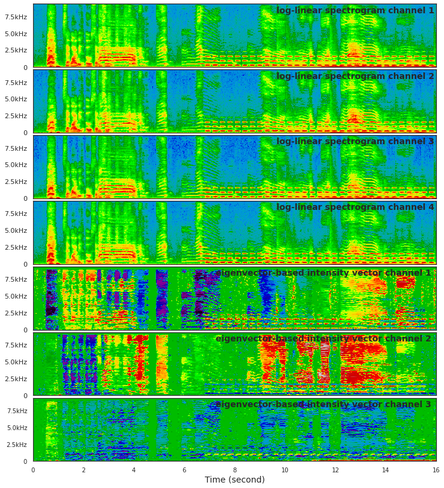
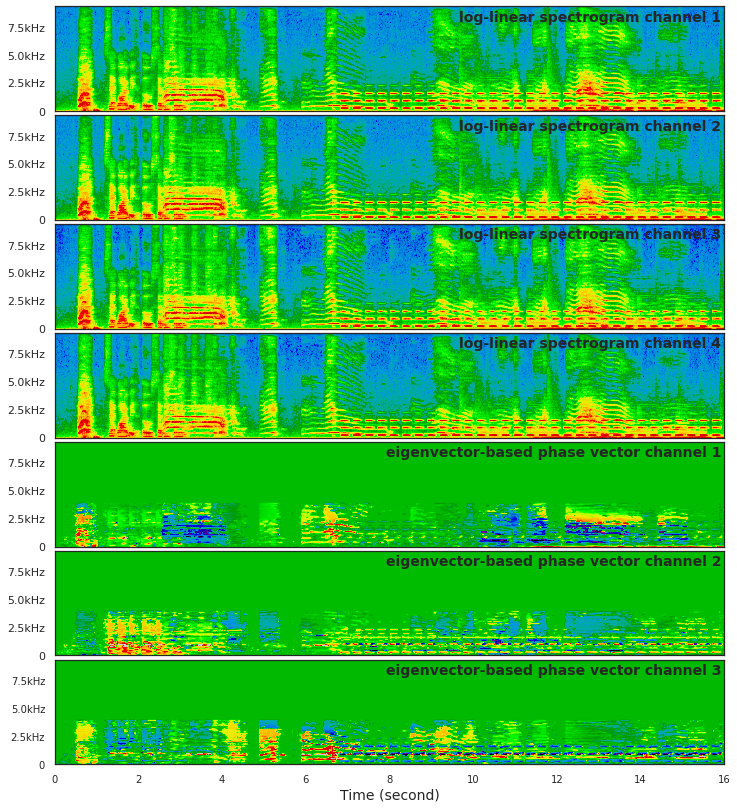
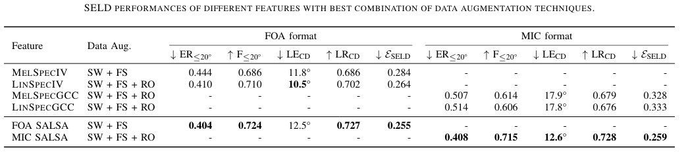
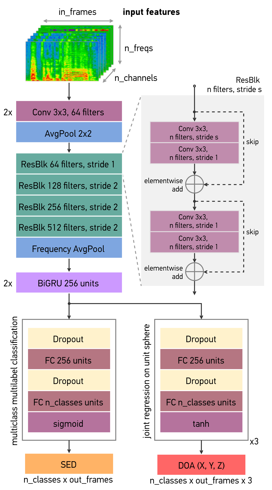
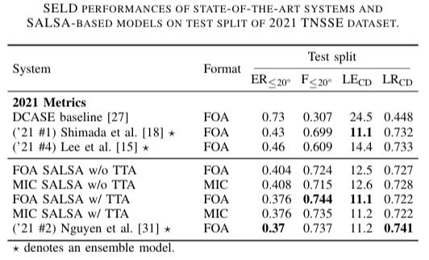
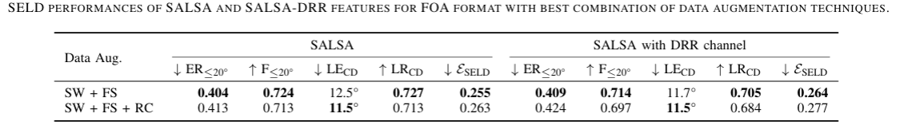

# SALSA: Spatial Cue-Augmented Log-Spectrogram Features for Polyphonic Sound Event Localization and Detection

[](https://paperswithcode.com/sota/sound-event-localization-and-detection-on-tau-1?p=salsa-spatial-cue-augmented-log-spectrogram) [](https://dcase.community/challenge2022/task-sound-event-localization-and-detection-evaluated-in-real-spatial-sound-scenes#baseline-system)

<p align="center">
         
        
        <em>Visualization of SALSA features of a 16-second audio clip in multi-source scenarios for 
            first-order ambisonics microphone (FOA) (left) and 4-channel microphone array (MIC) (right).</em>
</p>

Official implementation for **SALSA: Spatial Cue-Augmented Log-Spectrogram Features** for polyphonic sound event localization and detection.

**Update**: SALSA-Lite feature has been added to the repo.

> Thi Ngoc Tho Nguyen, Karn N. Watcharasupat, Ngoc Khanh Nguyen, Douglas L. Jones, Woon-Seng Gan. **SALSA: Spatial Cue-Augmented Log-Spectrogram Features for Polyphonic Sound Event Localization and Detection,** to appear in IEEE/ACM Transactions on Audio, Speech, and Language Processing, 2022. [[**arXiv**]](https://arxiv.org/abs/2110.00275)

> Thi Ngoc Tho Nguyen, Douglas L. Jones, Karn N. Watcharasupat, Huy Phan, Woon-Seng Gan. **SALSA-Lite: A Fast and Effective Feature for Polyphonic Sound Event Localization and Detection with Microphone Arrays,** in Proceedings of the 2022 IEEE International Conference on Acoustics, Speech and Signal Processing, 2022. [[**arXiv**]](https://arxiv.org/abs/2111.08192) [[**IEEE Xplore**]](https://ieeexplore.ieee.org/document/9746132)

## Introduction to sound event localization and detection
Sound event localization and detection (SELD) is an emerging research field that unifies the tasks of 
sound event detection (SED) and direction-of-arrival estimation (DOAE) by jointly recognizing the sound classes, 
and estimating the directions of arrival (DOA), the onsets, and the offsets of detected sound events.
While sound event detection mainly relies on time-frequency patterns to distinguish different sound classes,
direction-of-arrival estimation uses amplitude and/or phase differences between microphones to estimate source directions.
As a result, it is often difficult to jointly optimize these two subtasks.

## What is SALSA?

We propose a novel feature called Spatial Cue-Augmented Log-Spectrogram (SALSA) with exact time-frequency mapping 
between the signal power and the source directional cues, which is crucial for resolving overlapping sound sources. 
The SALSA feature consists of multichannel log-linear spectrograms stacked along with the normalized principal 
eigenvector of the spatial covariance matrix at each corresponding time-frequency bin. Depending on the types of microphone array,
the principal eigenvector can be normalized differently to extract amplitude and/or phase differences between the 
microphones. As a result, SALSA features are applicable for different microphone array formats such as first-order 
ambisonics (FOA) and multichannel microphone array (MIC). 

Experimental results on the TAU-NIGENS Spatial Sound Events (TNSSE) 2021 dataset with directional interferences showed that SALSA 
features outperformed other state-of-the-art features. Specifically, the use of SALSA features in the FOA format increased 
the F1 score and localization recall by 6% each, compared to the multichannel log-mel spectrograms with intensity vectors. 
For the MIC format, using SALSA features increased F1 score and localization recall by 16% and 7%, respectively, 
compared to using multichannel log-mel spectrograms with generalized cross-correlation spectra. 



Our ensemble model trained on SALSA features ranked second in the team category of the SELD task in the 
[2021 DCASE SELD Challenge](http://dcase.community/challenge2021/task-sound-event-localization-and-detection-results).

## Network architecture

We use a convolutional recurrent neural network (CRNN) in this code. The network consists of a CNN that is 
based on ResNet22 for [audio tagging](https://github.com/qiuqiangkong/audioset_tagging_cnn), a two-layer BiGRU,
and fully connected (FC) layers. The network can be adapted for different input features by setting the number
of input channels in the first convolutional layer to that of the input features.

<p align="center">
        
</p>

## Visualization of SELD output

Visualization of ground truth and predicted azimuth for test clip `fold6_room2_mix041` of the TAU-NIGENS Spatial Sound 
Events 2021 dataset. Legend lists the ground truth events in chronological order. Sound classes are color-coded.


## Comparison with state-of-the-art SELD systems

Simple CRNN models trained on SALSA features have shown to achieve similar to or even better SELD 
performance than many complex state-of-the-art systems on the 2020 and 2021 TNSSE datasets. We listed the performances 
of our models trained with the proposed SALSA features and other state-of-the-art SELD system in the following tables. 
For more results, please refer to the paper listed above. 

<p align="center">
        
</p>

## Prepare dataset and environment

This code is tested on Ubuntu 18.04 with Python 3.7, CUDA 11.0 and Pytorch 1.7

1. Install the following dependencies by `pip install -r requirements.txt`. Or manually install these modules:
    * numpy
    * scipy
    * pandas
    * scikit-learn
    * h5py
    * librosa
    * tqdm
    * pytorch 1.7
    * pytorch-lightning      
    * tensorboardx
    * pyyaml
    * munch

2. Download TAU-NIGENS Spatial Sound Events 2021 dataset [here](https://zenodo.org/record/4844825). 
This code also works with TAU-NIGENS Spatial Sound Events 2020 dataset [here](https://zenodo.org/record/4064792). 

3. Extract everything into the same folder. 

4. Data file structure should look like this:

```
./
├── feature_extraction.py
├── ...
└── data/
    ├──foa_dev
    │   ├── fold1_room1_mix001.wav
    │   ├── fold1_room1_mix002.wav  
    │   └── ...
    ├──foa_eval
    ├──metadata_dev
    ├──metadata_eval (might not be available yet)
    ├──mic_dev
    └──mic_eval
```

For TAU-NIGENS Spatial Sound Events 2021 dataset, please move wav files from subfolders `dev_train`, `dev_val`, 
`dev_test` to outer folder `foa_dev` or `mic_dev`. 

## Feature extraction

Our code support the following features:  

| Name        | Format   | Component     | Number of channels |
| :---        | :----:   | :---          |  :----:            |
| melspeciv   | FOA      | multichannel log-mel spectrograms  + intensity vector    | 7 |
| linspeciv   | FOA      | multichannel log-linear spectrograms  + intensity vector    | 7 |
| melspecgcc  | MIC      | multichannel log-mel spectrograms  + GCC-PHAT    | 10 |
| linspecgcc  | MIC      | multichannel log-linear spectrograms  + GCC-PHAT   | 10 |
| **SALSA**   | FOA      | multichannel log-linear spectrograms  + eigenvector-based intensity vector (EIV)    | 7 |
| **SALSA**   | MIC      | multichannel log-linear spectrograms  + eigenvector-based phase vector (EPV)    | 7 |
| **SALSA-IPD** | MIC    | multichannel log-linear spectrograms  + interchannel phase difference (IPD) | 7 |
| **SALSA-Lite**| MIC    | multichannel log-linear spectrograms  + normalized interchannel phase difference (NIPD) | 7 |

Note: the number of channels are calculated based on four-channel inputs.

To extract **SALSA** feature, edit directories for data and feature accordingly in `tnsse_2021_salsa_feature_config.yml` in 
`dataset\configs\` folder. Then run `make salsa`

To extract **SALSA-Lite** feature, edit directories for data and feature accordingly in `tnsse_2021_salsa_lite_feature_config.yml` in 
`dataset\configs\` folder. Then run `make salsa-lite`

To extract *linspeciv*, *melspeciv*, *linspecgcc*, *melspecgcc* feature, 
edit directories for data and feature accordingly in `tnsse_2021_feature_config.yml` in 
`dataset\configs\` folder. Then run `make feature`

## Training and inference

To train SELD model with SALSA feature, edit the *feature_root_dir* and *gt_meta_root_dir* in the experiment config 
`experiments\configs\seld.yml`. Then run `make train`. 

To train SELD model with SALSA-Lite feature, edit the *feature_root_dir* and *gt_meta_root_dir* in the experiment config 
`experiments\configs\seld_salsa_lite.yml`. Then run `make train`. 

To do inference, run `make inference`. To evaluate output, edit the `Makefile` accordingly and run `make evaluate`.

## DCASE2021 Sound Event Localization and Detection Challenge

We participated in [DCASE2021 Sound Event Localization and Detection Challenge](http://dcase.community/challenge2021/task-sound-event-localization-and-detection-results).
Our model ensemble ranked 2nd in the team ranking category. The models in the ensemble were trained on a variant of SALSA 
for FOA format. This variant has an additional channel for direct-to-reverberant ratio (DRR). For more information, please 
check out our [technical report](https://arxiv.org/abs/2106.15190). Ablation study on the TAU-NIGENS Spatial Sound 
Events 2021 dataset shows that adding DRR channel does not improve the SELD performance. 

We applied three data augmentation techniques, namely channel swapping (CS), frequency shifting (FS), and random cutout (RC) 
while training models for the DCASE challenge. However, later ablation study shows that for FOA format of the TAU-NIGENS Spatial Sound 
Events 2021 dataset, combination of only CS and FS is better than combination of CS, FS and RC.



## Citation
Please consider citing our papers if you find this code useful for your research. Thank you!!!

SALSA
```
@article{nguyen2021salsa,
  title={SALSA: Spatial Cue-Augmented Log-Spectrogram Features for Polyphonic Sound Event Localization and Detection},
  author={Nguyen, Thi Ngoc Tho and Watcharasupat, Karn N and Nguyen, Ngoc Khanh and Jones, Douglas L and Gan, Woon-Seng},
  journal={arXiv preprint arXiv:2110.00275},
  year={2021}
}
```

SALSA-Lite
```
@inproceedings{nguyen2022salsa_lite,
  title={SALSA-Lite: A Fast and Effective Feature for Polyphonic Sound Event Localization and Detection with Microphone Arrays},
  author={Nguyen, Thi Ngoc Tho and Jones, Douglas L and Watcharasupat, Karn N and Phan, Huy and Gan, Woon-Seng},
  booktitle={2022 IEEE International Conference on Acoustics, Speech and Signal Processing (ICASSP)},
  year={2022}
}
```

DCASE 2021 Technical Report
```
@techreport{nguyen2021dcase,
  title={DCASE 2021 Task 3: Spectrotemporally-aligned Features for Polyphonic Sound Event Localization and Detection},
  author={Nguyen, Thi Ngoc Tho and Watcharasupat, Karn and Nguyen, Ngoc Khanh and Jones, Douglas L and Gan, Woon Seng},
  institution={IEEE AASP Challenge on Detection and Classification of Acoustic Scenes and Events 2021},
  year={2021}
}
```
